# 树莓派 CM5 + Docker ROS2 硬件架构

## 硬件连接总览

```mermaid
graph TB
    subgraph CM5["树莓派 CM5 主板"]
        direction TB

        subgraph Peripherals["外设接口"]
            CSI["📷 CSI 接口 → 摄像头<br/>(OV5647)"]
            SPI0["🖥️ SPI0 + GPIO 27/25/0<br/>→ LCD ST7789V 240×320"]
            USB["⌨️ USB → 键盘"]
            I2S_OUT["🔊 I2S + I2C → WM8960<br/>→ 喇叭"]
            I2S_IN["🎤 I2S + I2C → WM8960<br/>→ 板载麦克风"]
            UART0["🔌 UART0 (ttyAMA0)"]
            UART5["🔌 UART5 (ttyAMA5)"]
            USB_LIDAR["📡 USB → 激光雷达<br/>(LD19/LD06)"]
        end

        subgraph OS["Luwu OS (Debian 13)"]
            direction LR
            DRV_CAM["摄像头驱动<br/>Picamera2"]
            DRV_AUD["音频驱动<br/>ALSA"]
            DRV_DOG["机器狗驱动<br/>xgolib/XGO_DOG"]
            DRV_LIDAR["雷达驱动<br/>ldlidar"]
        end

        subgraph DockerContainer["🐳 Docker 容器"]
            ROS2["ROS2 Jazzy<br/>--network host"]
            SLAM["🗺️ SLAM 建图"]
            NAV["🧭 导航"]
            PERCEP["👁️ 视觉感知"]
        end
    end

    subgraph RobotBody["🤖 机器狗本体"]
        MCU["机器狗主控板"]
        SERVOS["12 路舵机"]
        BATTERY["🔋 电池"]
        BODY_IMU["IMU 传感器"]
    end

    subgraph ExternalHW["外部硬件"]
        LIDAR_DEV["激光雷达<br/>(LD19 等)"]
        SCREEN["触摸屏"]
        KEYBOARD["键盘"]
        SPEAKER["喇叭"]
        MIC["麦克风"]
        CAMERA["摄像头模组"]
    end

    %% 物理连接
    CSI --> CAMERA
    SPI0 --> SCREEN
    USB --> KEYBOARD
    I2S_OUT --> SPEAKER
    I2S_IN --> MIC
    USB_LIDAR --> LIDAR_DEV
    UART0 --> MCU
    UART5 -.->|"备用"| MCU

    %% 驱动层
    DRV_CAM -.-> CSI
    DRV_AUD -.-> I2S_OUT
    DRV_AUD -.-> I2S_IN
    DRV_DOG -.-> UART0
    DRV_DOG -.-> UART5
    DRV_LIDAR -.-> USB_LIDAR

    %% 机器狗内部
    MCU --> SERVOS
    MCU --> BATTERY
    MCU --> BODY_IMU

    %% Docker 与宿主机
    DRV_CAM -.->|"DDS/网络"| ROS2
    DRV_DOG -.->|"DDS/网络"| ROS2
    DRV_LIDAR -.->|"DDS/网络"| ROS2
    ROS2 --> SLAM
    ROS2 --> NAV
    ROS2 --> PERCEP

    style CM5 fill:#1a1a2e,stroke:#16213e,color:#eee
    style Peripherals fill:#16213e,stroke:#0f3460,color:#eee
    style OS fill:#0f3460,stroke:#533483,color:#eee
    style DockerContainer fill:#1a1a2e,stroke:#00b4d8,color:#eee
    style RobotBody fill:#16213e,stroke:#e94560,color:#eee
    style ExternalHW fill:#0f3460,stroke:#2ecc71,color:#eee
```



## 接口对照表

| 硬件 | 物理接口 | 系统设备 | 驱动 |
|------|---------|---------|------|
| 摄像头 | CSI | /dev/video0 | Picamera2 / libcamera |
| 屏幕 | SPI0 + GPIO 27/25/0 | /dev/fb-spi (udev→fb1) | fbtft 内核驱动 |
| 键盘 | USB | /dev/input/* | evdev |
| 麦克风 | I2S + I2C (WM8960) | hw:0,0 | ALSA |
| 喇叭 | I2S + I2C (WM8960) | hw:0,0 | ALSA |
| 机器狗 | UART0 (GPIO14/15) | /dev/ttyAMA0 | xgolib |
| 机器狗(备) | UART5 (GPIO12/13) | /dev/ttyAMA5 | xgolib |
| 激光雷达 | USB | /dev/ttyUSB0 | ldlidar / 串口 |

## Docker 通信方式

```
┌──────────────────────────────────────┐
│          树莓派 CM5 宿主机             │
│                                      │
│  摄像头 ──→ 帧数据                     │
│  雷达   ──→ 点云数据                   │
│  机器狗 ──→ 关节/IMU/电池              │
│  麦克风 ──→ 音频流                     │
│            │                         │
│            │ 封装为 ROS2 Topic        │
│            │ (rclpy publisher)       │
│            ▼                         │
│    ╔══════════════════════╗          │
│    ║  DDS 多播发现         ║          │
│    ║  (同一网络栈)         ║          │
│    ╚══════╤═══════════════╝          │
│           │                          │
│  ┌────────┴──────────────────────┐  │
│  │  🐳 Docker: ROS2 Jazzy        │  │
│  │  --network host               │  │
│  │                                │  │
│  │  订阅: /image_raw  → SLAM     │  │
│  │  订阅: /scan       → 导航     │  │
│  │  订阅: /joint_states → 里程计 │  │
│  │                                │  │
│  │  发布: /cmd_vel → 控制机器狗  │  │
│  │  发布: /map     → 地图        │  │
│  └───────────────────────────────┘  │
└──────────────────────────────────────┘
```

## Docker 启动命令

```bash
docker run -d --name ros2-robot \
  --network host \
  --restart unless-stopped \
  -v /home/pi/ros2_ws:/ros2_ws \
  osrf/ros:jazzy-ros-base \
  ros2 launch robot_brain bringup.launch.py
```

> `--network host` 是关键：容器与宿主机共享网络栈，ROS2 的 DDS 节点发现通过 UDP 多播直接生效，无需额外配置。
